<h1>Visualization Web app (for Plotly Dash)</h1>

> **Note**
> All data in this repository is sample data.
> 
 
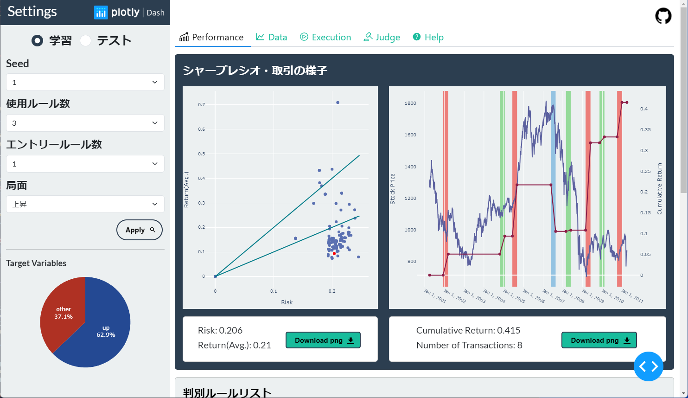
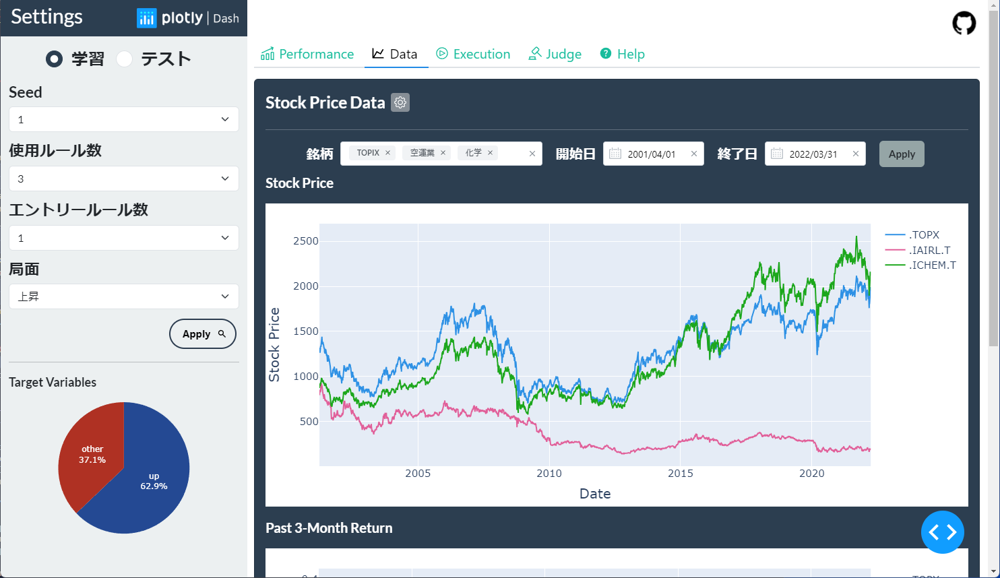
 
<h1>Overview</h1>
分析結果をインタラクティブに可視化することができるWebアプリケーションです。 
サイドバーでパラメータを選択することで、右側にグラフが表示されます。
 
 
<h1>Tools</h1>
<ul>
    <li>Windows11</li>
    <li>Python 3.11.4</li>
    <li>Visual Studio Code</li>
</ul>
 
<h1>Python Library</h1>
<ul>
    <li>dash：2.13.0</li>
    <li>dash-auth：2.0.0</li>
    <li>dash-bootstrap-components：1.4.2</li>
    <li>dash-core-components：2.0.0</li>
    <li>dash-html-components：2.0.0</li>
    <li>dash-iconify：0.1.2</li>
    <li>dash-mantine-components：0.12.1</li>
    <li>pandas：2.0.3</li>
    <li>plotly：5.16.1</li>
</ul>
 
<h1>Directory Structure</h1>
app/ 
　├─data 
　│  　├─cd_sorted 
　│  　│  　　　├─test 
　│  　│  　　　└─train 
　│  　├─rd_sorted 
　│  　├─ruiwa_df 
　│  　│  　　　├─test 
　│  　│  　　　└─train 
　│  　├─sharpe_df 
　│  　│  　　　├─test 
　│  　│  　　　└─train 
　│  　└─origin 
　├─screenshot 
　└─src 
　  　　├─assets 
　  　　│  　　└─img 
　  　　└─components 

 
<ul>
    <li>data：データ管理ディレクトリ</li>
        <ul>
            <li>cd_sorted：判別ルール情報管理ディレクトリ</li>
            <ul>
                <li>train：学習</li>
                <li>train：テスト</li>
            </ul>
            <li>rd_sorted：判別ルール情報管理ディレクトリ</li>
            <li>ruiwa_df：取引情報管理ディレクトリ</li>
            <li>sharpe_df：運用パフォーマンス管理ディレクトリ</li>
            <ul>
                <li>train：学習</li>
                <li>train：テスト</li>
            </ul>
            <li>origin：学習用データ管理ディレクトリ</li>
        </ul>
    <li>screenshot：スクリーンショット管理ディレクトリ</li>
    <li>src：実行コード管理ディレクトリ</li>
        <ul>
            <li>assets：スタイルシート・画像管理ディレクトリ</li>
            <ul>
                <li>img：画像管理ディレクトリ</li>
            </ul>
            <li>components：コンポーネント管理ディレクトリ</li>
        </ul>
</ul>
 
<h1>Python File Structure</h1>
<ul>
    <li>main.py：実行ファイル</li>
    <li>app.py：app設定</li>
    <li>callback.py：コールバック設定</li>
    <li>func.py：コールバック使用関数定義</li>
    <li>layout.py：layout設定</li>
    <ul>
        <li>sidebar.py：sidebarコンポーネント</li>
        <li>performance.py：performanceタブコンポーネント</li>
        <li>data.py：dataタブコンポーネント</li>
        <li>exection.py：exectionタブコンポーネント</li>
        <li>judge.py：judgeタブコンポーネント</li>
        <li>help.py：helpタブコンポーネント</li>
        <li>footer.py：footerタブコンポーネント</li>
    </ul>
</ul>
 
<h1>Function</h1>

<h2>Sidebar(Setting)</h2>
<table>
<tr>
<td width='40%'>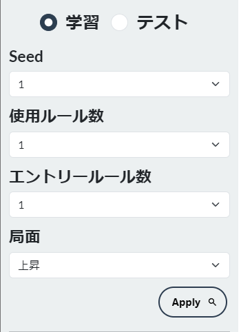</td>
<td><ul>
    <li>学習 or テスト: 学習データかテストデータを選択します。</li>
    <li>Seed: データ番号を選択します(30回分の結果データがあります)。</li>
    <li>使用ルール数: 局面の判断に使用するルール数を選択します。</li>
    <li>エントリールール数: いくつのルールが適合した時にエントリーするか選択します。</li>
    <li>局面: 上昇局面か下落局面を選択します。</li>
    <li>Applボタン: クリックすることで選択条件をグラフへ適用します。</li>
</ul>
</td>
</tr>
</table>
<table>
<tr>
<td width='40%'>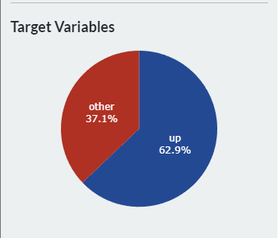</td>
<td><ul>
    <li>説明変数の割合を表す円グラフです。</li>
    <li>”学習”にチェックがついているときは学習データ、”テスト”にチェックがついているときはテストデータの割合が表示されます。</li>
</ul>
</td>
</tr>
</table>
 

<h2>Performance(Tab1)</h2>
<table>
<tr>
<td>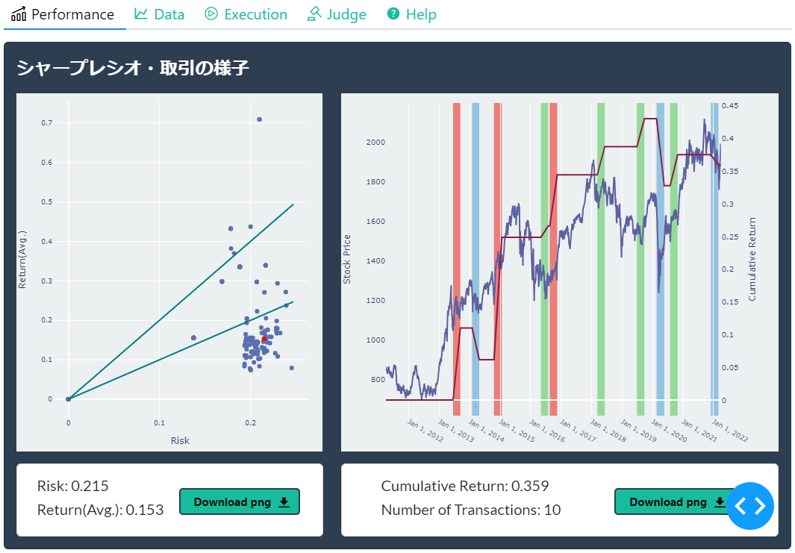</td>
<td>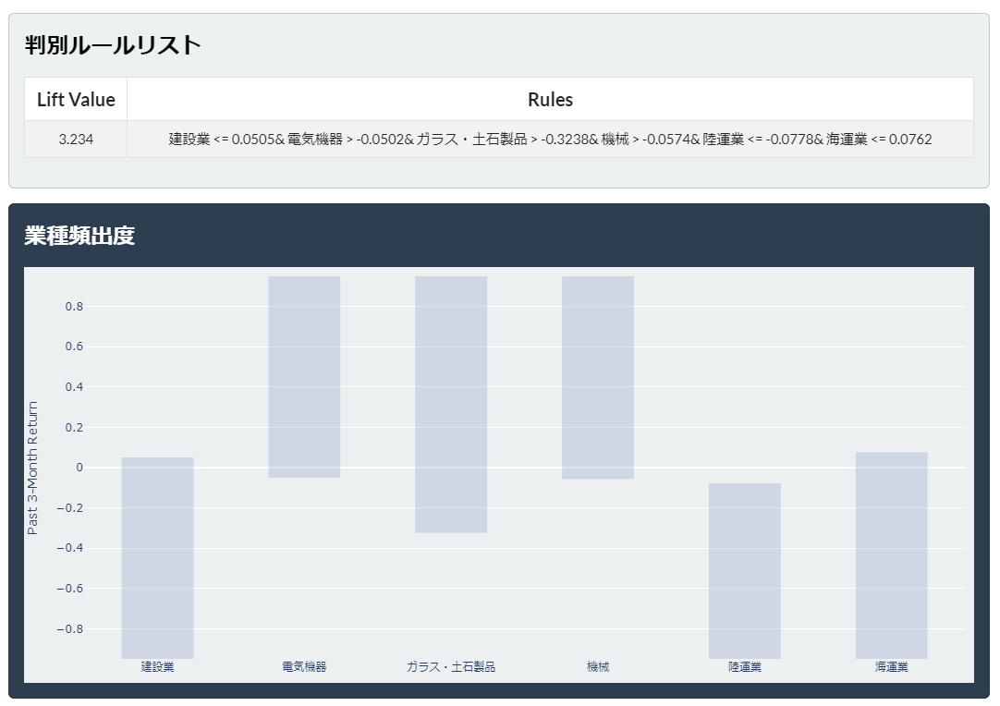</td>
</tr>
</table>
 

> **Note**
> Download png button is not available(under construction).
 
<ul>
    <li>左上：シャープレシオグラフ。選択したSeedのすべてのデータが表示され、選択した条件のデータは赤い点で表示されます。</li>
    <li>右上：選択した条件が局面と判断した期間とその取引のリターンが表示されます。</li>
    <li>中央：使用した判別ルールの一覧とそのLift値が表示されます。</li>
    <li>下：選択した条件に出現する業種を濃度で表示します。</li>
</ul>
 

<h2>Data(Tab2)</h2>
<table>
<tr>
<td>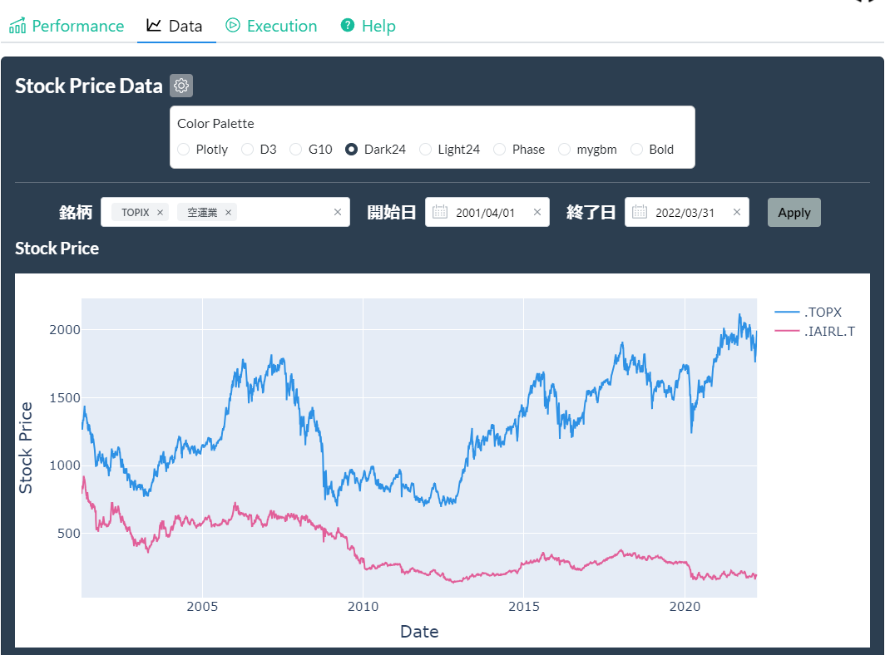</td>
<td>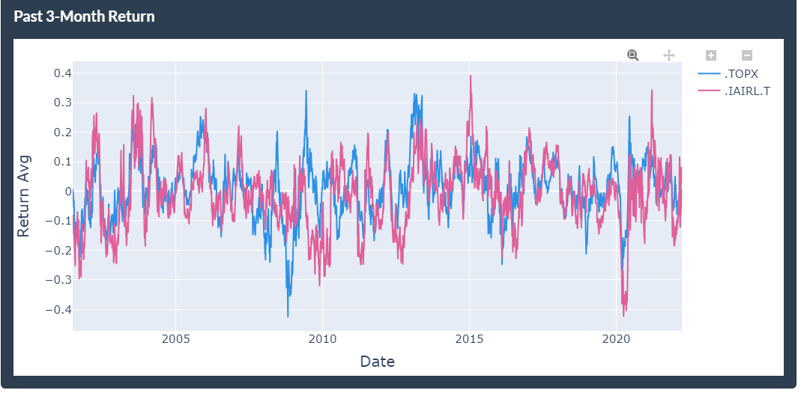</td>
</tr>
</table>
 

<ul>
    <li>カラーパレット：歯車アイコンをクリックするとグラフのカラーパレットを選択できます。</li>
    <li>銘柄：グラフに表示したい銘柄を選択できます。</li>
    <li>開始日、終了日：グラフに表示したい範囲を指定できます。</li>
    <li>Applyボタン：クリックすると変更情報がグラフに反映されます。</li>
    <li>グラフ(上)：株価データが表示されます。</li>
    <li>グラフ(下)：過去３か月リターンデータが表示されます。</li>
</ul>
 

<h2>Exection(Tab3)</h2>
<table>
<tr>
<td align='center'>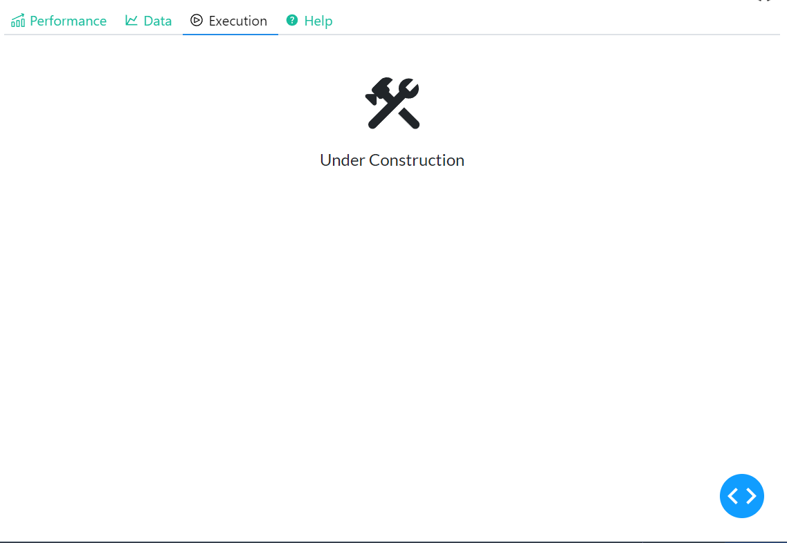</td>
</tr>
</table>
 

<ul>
    <li>現在、作成中です。</li>
</ul>
 

<h2>Judge(Tab4)</h2>
<table>
<tr>
<td align='center'>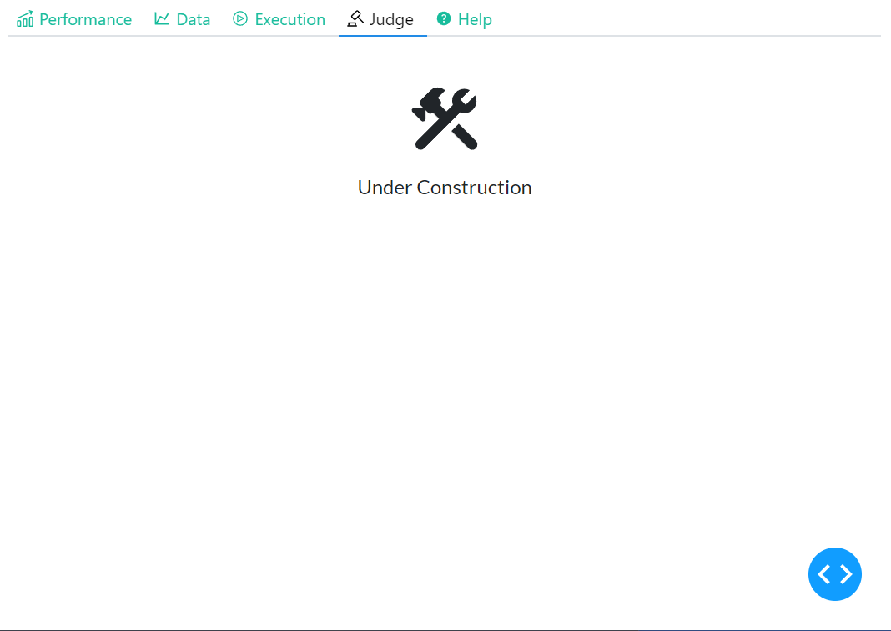</td>
</tr>
</table>
 

<ul>
    <li>現在、作成中です。</li>
</ul>
 

<h2>Help(Tab5)</h2>
<table>
<tr>
<td align='center'>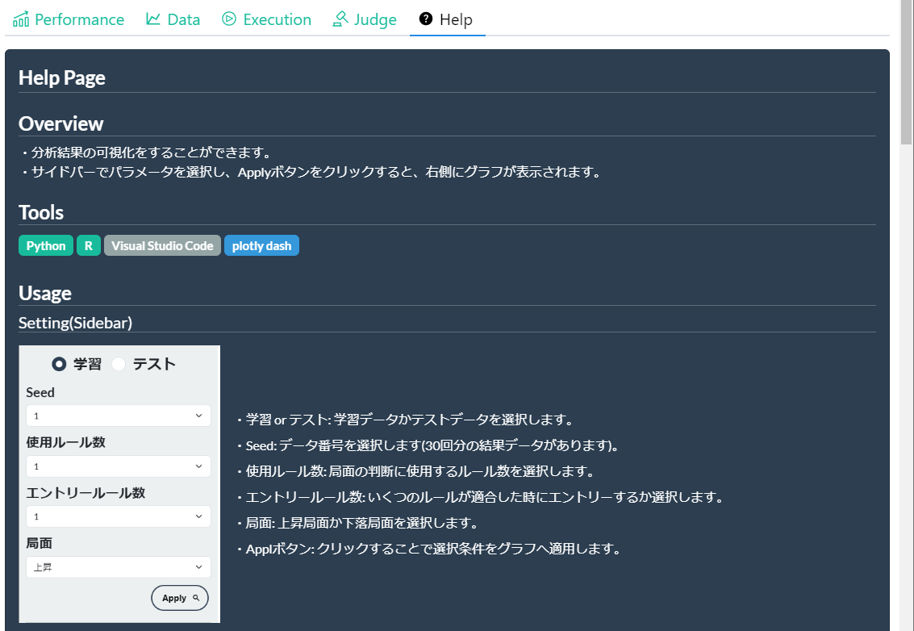</td>
</tr>
</table>
 

<ul>
    <li>基本的な操作・表示内容の説明</li>
</ul>
 

<h1>References</h1>
<ul>
    <li>
        <a href='https://plotly.com/python//'>Plotly</a>
    </li>
    <li>
        <a href='https://dash.plotly.com/'>Plotly Dash</a>
    </li>
    <li>
        <a href='https://dash-bootstrap-components.opensource.faculty.ai/'>Dash Bootstrap Components</a>
    </li>
    <li>
        <a href='https://www.dash-mantine-components.com/'>Dash Mantine Components</a>
    </li>
    <li>
        <a href='https://sakizo-blog.com/103/'>Referenced websites</a>
    </li>
</ul>