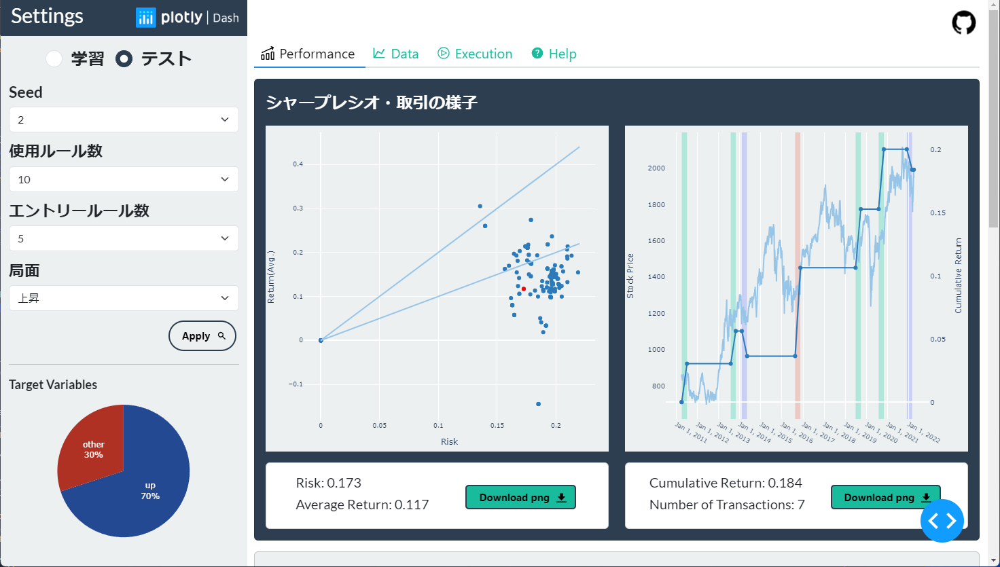
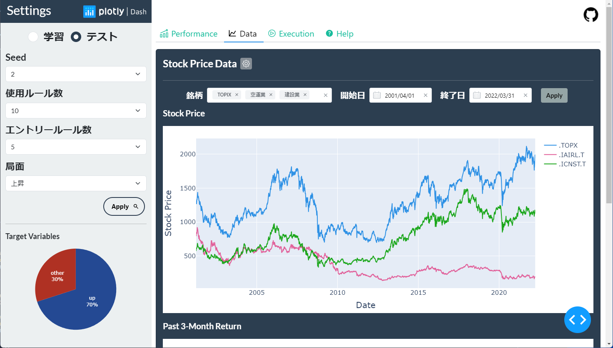

<h1>Visualization Web app (for plotly Dash)</h1>

<h1>Overview</h1>
This web app allows you to interactively visualize your analyzed data. 
Select and apply the parameters from the sidebar and the graph will appear on the right side. 

<h1>Function</h1>

<h1>Reference</h1>
<ul>
    <li>
        <a href='https://plotly.com/python//'>Plotly</a>
    </li>
    <li>
        <a href='https://dash.plotly.com/'>Plotly Dash</a>
    </li>
    <li>
        <a href='https://dash-bootstrap-components.opensource.faculty.ai/'>Dash Bootstrap Components</a>
    </li>
    <li>
        <a href='https://www.dash-mantine-components.com/'>Dash Mantine Components</a>
    </li>
    <li>
        <a href='https://sakizo-blog.com/103/'>Referenced websites</a>
    </li>
</ul>